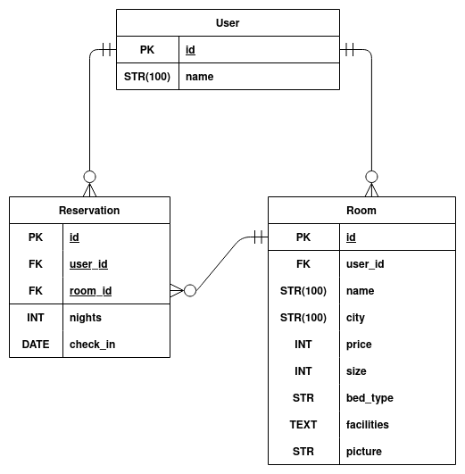

# Final group capstone - Room reservation Backend


> Room reservation app



This project is based on an app to book an appointment to try a motorcycle. It has been customized to allow you to book a room or try hosting people with yours.

## Project

- [Kanban board](https://github.com/usmansbk/rooms-backend/projects/1)

- [GitHub](https://github.com/usmansbk/rooms-backend/tree/main)

- Final number of team members: 4


## Frontend

[GitHub Repo](https://github.com/usmansbk/rooms-frontend)

[Live Link](https://microverse-rooms.netlify.app/)

## API

[Heroku](https://polar-island-18380.herokuapp.com)

## Built With

- Ruby on Rails
- PostgreSQL

## Getting Started

To get a local copy up and running follow these simple example steps.

### Prerequisites

- [Ruby v3.0.2](https://www.ruby-lang.org/en/)
- [Rails v6.1.4](https://gorails.com/)
- [RSwag](https://github.com/rswag/rswag)

## Setup

```sh
git clone https://github.com/usmansbk/rooms-backend.git

cd ./rooms-backend
```

### Install

```sh
bundle install
```

### Database

```sh
# Create user
sudo -u postgres createuser rooms_backend -s

# Create the database
rails db:create

## Apply migration
rails db:migrate
```

### Run

```sh
rails s
```

### Test

```sh
rspec
```

### Generate documentation

```sh
rails rswag
```

### API Documentation

[Swagger](http://localhost:3000)

### Troubleshoot

```sh
### Undo migrations
rake db:migrate VERSION=0
```

## Authors

👤 **Usman**

- GitHub: [@usmansbk](https://github.com/usmansbk)
- LinkedIn: [Usman Suleiman Babakolo](https://linkedin.com/in/usmansbk)

👤 **Simon**

- GitHub: [@SimonGrchevski](https://github.com/SimonGrchevski)
- LinkedIn: [Simon Grchevski](https://www.linkedin.com/in/simon-grchevski-682935209/)

👤 **Olawale**

- GitHub: [@olawale-o](https://github.com/olawale-o)
- LinkedIn: [Omoogun Olawale](https://linkedin.com/in/olawaleomoogun)

👤 **Denis**

- GitHub: [@denisdiaconu](https://github.com/denisdiaconu)
- LinkedIn: [Denis Andrei Diaconu](https://www.linkedin.com/in/denis-diaconu-1394091b7/)

## 🤝 Contributing

Contributions, issues, and feature requests are welcome!

Feel free to check the [issues page](../../issues/).

## Show your support

Give a ⭐️ if you like this project!

## Acknowledgments

- Microverse
- Original design by [Murat Korkmaz](https://www.behance.net/muratk) on Behance

## License

[MIT](./LICENSE)
